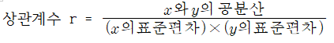

# 통계 단어 정리

## 통계 이론

- ### 평균(mean)

  데이터 총합 / 데이터의 총 갯수
    
  극대, 극소값(outlier)에 영향을 받는다.

- ### 중앙값(median)
  데이터를 크기순서대로 늘어놓았을 때 중앙에 위치하는 값
    
  극대, 극소값(outlier)에 영향을 받지 않는다.
    
  데이터의 갯수에 따라 구하는 공식이 다르다.
  1. 데이터 갯수가 홀수일 경우
  1. 데이터 갯수가 짝수일 경우
- ### 최빈값(mode)
  데이터 중 가장 많이 나온 값
- ### (outlier)
  평균 데이터의 범위를 크게 벗어난 값
    
  일반적으로 box plot을 그렸을 때 box의 크기의 1.5배를 넘는 부근의 데이터들을 outlier라고 부른다.
- ### 편차(deviation)
  각 데이터와 평균값의 차이
- ### 분산(variance)
  편차제곱의 총합 / 데이터의 총 개수
- ### 표준편차(standard deviation)
  분산의 제곱근으로 계산한 값
- ### 산포도()
- ### 공분산(covariance)
  두 데이터(x,y)의 편차끼리 곱해서 더한 값 / 데이터 총 개수
- ### Z-score
- ### 상관계수(correlation coefficient)
  두 데이터(x,y)가 얼마나 연관되어 있는지 알려주는 값
  - 계산 방식
  
    
  - 측정표
  
    | r | 상관 정도 |
    | ---------|-----------|
    |0.0 ~ 0.3| 거의 상관없음|
    |0.3 ~ 0.7| 약한 상관관계|
    |0.7 ~ 01| 강한 상관관계|
- ### 사분위수(quartiles)
  전체 데이터의 Q1(25%), Q2(50%), Q3(75%) 비율이 되는 구간을 알려주는 값
- ### 편상관계수()
  데이터(z)의 영향을 제외한 다음 두 데이터의 관계성이 얼마나 강한지 측정하는 값
  - 예시
- ### 대립가설()
  자료로부터의 강력한 증거에 의하여 입증하고자 하는 가설
   
  주장하고 싶은 내용이나 사실에 기초한 가설
- ### 귀무가설()
  대립가설에 상반되는 가설. "없다"에 기초한 가설
- ### 독립변수()
  원인을 제공하는 값
- ### 종속변수()
  독립변수가 변함에 따라 영향을 받는 값
- ### 모집단(population)
- ### 모수(parameter)
- ### 자유도(degree of freedom)
- ### p값(p-value)
- ### 유의수준(significance level)
- ### 1종 오류(type 1 error)
- ### 2종 오류(type 2 error)
- ### 양측검정(tow-tailed test)
- ### A/B test
- ### T test
- ### 분산분석(ANOVA, analysis of variance)
- ### 왜도(skewness)
- ### 첨도(kurtosis)
- ### 기각역(critical region)
    

## 그래프

- ### 히스토그램(histogram)
- ### 정규분포도
- ### 표준 정규분포도
- ### 상자수염그림(boxplot)
